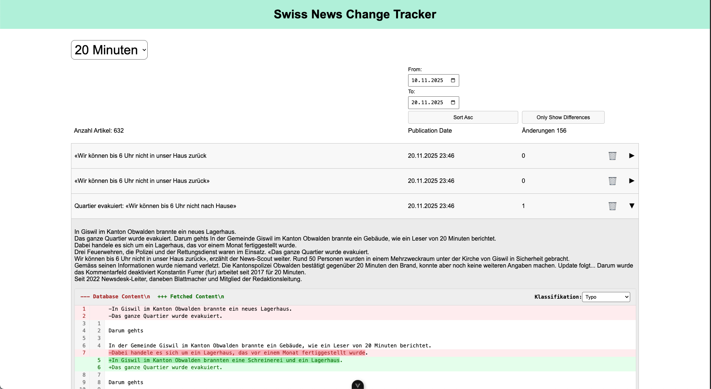

# swiss-news-change-tracker

Application to crawl articles from swiss online news platforms.

## Setup

The project requires Python 3.8+ and Node.js 14+.

1. Clone the repository:

```bash
git clone https://github.com/dariohollbach/swiss-news-change-tracker.git
cd swiss-news-change-tracker
```
2. Create a virtual environment and activate it:

```bash
python3 -m venv venv
source venv/bin/activate
```
3. Install the required dependencies:

```bash
pip install -r requirements.txt
```

It was developed to run on raspberry pi OS but should work on any Unix-like system.
It is recommended to run the crawler application inside the raspberry pi and then download the database file to your local machine to run the web application.

To download the database file from the raspberry pi to your local machine, you can use `scp`:

```bash
scp pi@<raspberry_pi_ip>:/path/to/news_articles.db /local/path/to/news_articles.db
```

## Database

The database is managed using SQLite. The schema is defined in `src/database_manager.py`.
To initialize the database, run the following command:

```bash
python3 src/database_manager.py
```

The database file `swiss_news_articles.db` will be created in the directory from where you call the application.

## Web Crawler
The web crawler is implemented in `main.py`. It scrapes articles from predefined news websites and stores them in the database.
To run the crawler, execute:

```bash
python3 src/main.py
```

### Cron Job Setup
To automate the web crawling process, you can set up a cron job that runs every 10 minutes. Add the following line to your crontab (edit with `crontab -e`):

```cron
*/10 * * * * cd /path/to/swiss-news-change-tracker/ && python3 /path/to/swiss-news-change-tracker/main.py >> /path/to/swiss-news-change-tracker/swiss_news_change_tracker_log 2>&1
```

## Web Application
The web application is built using Flask for the backend and Vue.js for the frontend.

> [!IMPORTANT] 
> The application needs to be run from the same directory where the database file `swiss_news_articles.db` is located.

To start the Flask server, navigate to the `webapp` directory and run:

```bash
python3 webapp/main.py
```
The frontend can be served using a development server. Navigate to the `webapp` directory and run:

```bash
npm install
npm run dev
```

